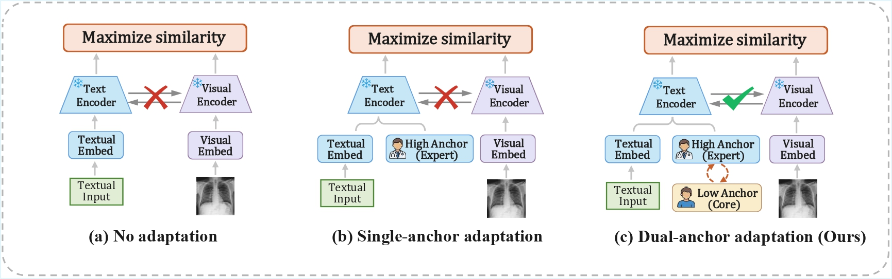
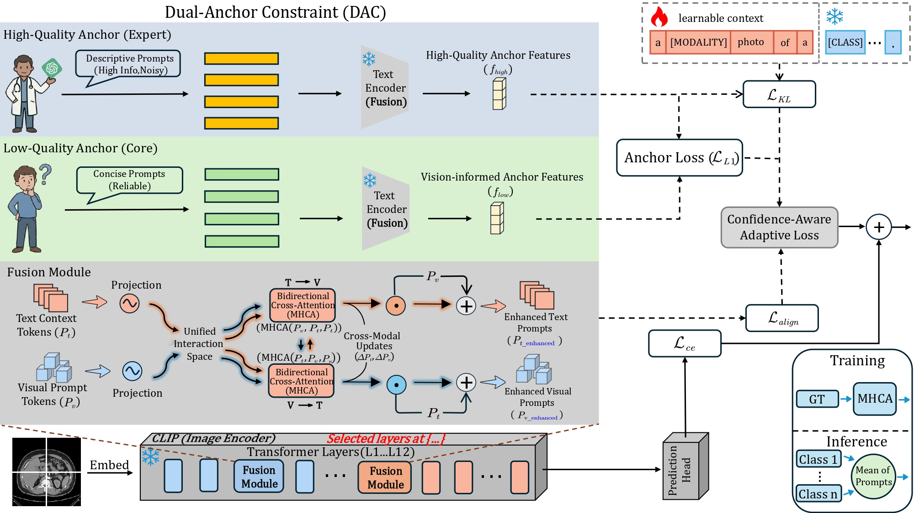

# BioMed-DPT: Dual Modality Prompt Tuning for Biomedical Vision-Language Models
## Overview

<strong>Abstract:</strong> <em>Biomedical Vision--Language Models (VLMs) have shown remarkable promise in few-shot medical diagnosis but face a critical bottleneck: <em>fragility to prompt variations</em>.
Existing adaptation frameworks typically optimize visual and textual prompts as independent streams, relying on ideal “Golden Prompts.”
In clinical reality, where descriptions are often noisy and heterogeneous, this modality isolation leads to unstable cross-modal alignment.
To address this, we propose <strong>BiomedAP</strong>, a vision--informed dual-anchor framework with gated cross-modal fusion.
BiomedAP enforces <em>synergistic alignment</em> through two mechanisms:
(1) <strong>Gated Cross-Modal Fusion</strong>, which enables layer-wise interaction between modalities, acting as a <em>dynamic noise regulator</em> to suppress irrelevant textual cues; and
(2) a <strong>Dual-Anchor Constraint</strong> that regularizes learnable prompts toward stable semantic centroids derived from both expert templates (High Anchors) and <strong>vision-informed intrinsic semantics</strong> (Low Anchors).
Extensive experiments across 11 benchmarks demonstrate that BiomedAP consistently surpasses baselines, achieving competitive few-shot accuracy and markedly enhanced robustness under prompt perturbations.</em>

## Method

  

**Overall framework of MQAC with cross-modal prompt fusion.**
  MQAC forms two anchors from clinical text: a High-Quality (Expert) branch (descriptive/noisy) and a Low-Quality (Core) branch (reliable).
  Their features ($f_{high}$, $f_{low}$) regularize the learnable text context to mitigate prompt drift.
  Training optimizes a composite loss, where a **Confidence-Aware Adaptive Loss** balances anchor terms and the task loss.
  The **Unified Interaction Space** injects bidirectional cross-attention (MHCA) between text-context and visual-prompt tokens at selected transformer layers to produce enhanced prompts for class-wise aggregation at inference.

##  Supported Methods

| Method                    | Paper                                         |                             Configs                             |          Training Scripts          | Trainers   |
|---------------------------|:----------------------------------------------|:---------------------------------------------------------------:|:----------------------------------:|:----------:|
| BiomedCoOp                 | [CVPR 2025](https://arxiv.org/abs/2411.15232)       | [link](configs/trainers/BiomedCoOp)                             | [link](scripts/biomedcoop)        | [link](trainers/BiomedCoOp) |
| CLIP                       | [ICML 2021](https://arxiv.org/abs/2103.00020) | [link](configs/trainers/Zeroshot)                               | [link](scripts/zeroshot)          | [link](trainers/Zeroshot)        |
| CoOp                        | [IJCV 2022](https://arxiv.org/abs/2109.01134) | [link](configs/trainers/CoOp)                                   | [link](scripts/coop)             | [link](trainers/CoOp)        |
| CoCoOp                      | [CVPR 2022](https://arxiv.org/abs/2203.05557) | [link](configs/trainers/CoCoOp)                                 | [link](scripts/cocoop)           | [link](trainers/CoCoOp)      |
| KgCoOp                      | [CVPR 2023](https://arxiv.org/abs/2303.13283) | [link](configs/trainers/KgCoOp)                                 | [link](scripts/kgcoop)           | [link](trainers/KgCoOp)      |
| ProGrad                     | [ICCV 2023](https://arxiv.org/abs/2205.14865) | [link](configs/trainers/ProGrad)                                | [link](scripts/prograd)          | [link](trainers/ProGrad)     |
| CLIP-Adapter                | [IJCV 2024](https://arxiv.org/abs/2110.04544) | [link](configs/trainers/CLIP_Adapter)                            | [link](scripts/clip_adapter)     | [link](trainers/ClipAdapter)|
| Tip-Adapter                 | [ECCV 2022](https://arxiv.org/abs/2111.03930) | [link](configs/trainers/TiP_Adapter)                             | [link](scripts/tip_adapter)      | [link](trainers/TipAdapter) |
| LP                          | [ICML 2021](https://arxiv.org/abs/2103.00020) | [link](configs/trainers/LP)                                     | [link](scripts/linear_probe)     | [link](trainers/LP)          |
| LP++                        | [CVPR 2024](https://arxiv.org/abs/2404.02285) | [link](configs/trainers/LP2)                                    | [link](scripts/linear_probe2)    | [link](trainers/LP2)         |

## Results
Results reported below show accuracy for few-shot scenarios as well as base and novel classes across 11 biomedical recognition datasets averaged over 3 seeds.
### Few-shot Evaluation
| **Method**             | $K=1$ | $K=2$ | $K=4$ | $K=8$ | $K=16$ |
|-------------------------|:-------:|:-------:|:-------:|:-------:|:-------:|
| [CLIP-Adapter](https://arxiv.org/abs/2110.04544)           |  46.54  |   45.18   |   45.45   |   46.27   |   47.75   |
| [Tip-Adapter](https://arxiv.org/abs/2111.03930)            |   49.11   |   54.06   |   58.93   |   63.46   |   67.18   |
| [Standard LP](https://arxiv.org/abs/2103.00020) |   51.80   |   54.54   |   60.49   |   67.56   |   68.70   |
| [LP++](https://arxiv.org/abs/2404.02285)         |   53.57   |   53.55   |   57.26   |   64.89   |   68.70   |
| [CoOp](https://arxiv.org/abs/2109.01134)         |   50.18   |   54.17   |   59.77   |   65.85   |   69.72   |
| [CoCoOp](https://arxiv.org/abs/2203.05557)       |   48.53   |   51.28   |   54.69   |   61.09   |   65.10   |
| [KgCoOp](https://arxiv.org/abs/2303.13283)       |   52.16   |   54.24   |   59.21   |   63.87   |   64.85   |
| [ProGrad](https://arxiv.org/abs/2205.14865)      |   51.37   |   54.40   |   60.61   |   65.50   |   67.03   |
| [BiomedCoOp](https://arxiv.org/abs/2411.15232)   |   56.69   |   58.58   |   64.45   |   68.84   |   72.13   |
| [Biomed-DPT](https://arxiv.org/abs/2505.05189)   |   59.03   |   61.27   |   66.12   |   70.76   |   73.51   |
| **BiomedAP(Ours)** | **63.57** | **64.89** | **67.92** | **71.21** | **75.09** |

### Base-to-Novel Generalization
| Name                                                      | Base Acc. | Novel Acc. |    HM     |
|-----------------------------------------------------------|:---------:|:----------:|:---------:|
| [BiomedCLIP](https://arxiv.org/abs/2303.00915) | 47.84 | 65.42 | 53.81 |
| [CoOp](https://arxiv.org/abs/2109.01134)       |   74.28   |   67.93    | 71.11 |
| [CoCoOp](https://arxiv.org/abs/2203.05557)     |   72.95   |   70.02    | 71.48 |
| [KgCoOp](https://arxiv.org/abs/2303.13283)     |   69.15   |   67.15    | 68.37 |
| [ProGrad](https://arxiv.org/abs/2205.14865)    |   71.97   |   69.06    | 70.52 |
| [BiomedCoOp](https://arxiv.org/abs/2411.15232) |   76.16   |   73.09    | 74.62 |
| [Biomed-DPT](https://arxiv.org/abs/2505.05189) |   78.06   |   75.97    | 77.02 |
| **BiomedAP(Ours)**                             |   **81.62**   |   **78.42**   | **80.02** |

## Installation 
For installation and other package requirements, please follow the instructions detailed in [INSTALL.md](assets/INSTALL.md). 

## Data preparation
Please follow the instructions at [DATASETS.md](assets/DATASETS.md) to prepare all datasets.

## Training and Evaluation
Please refer to the [RUN.md](assets/RUN.md) for detailed instructions on training, evaluating and reproducing the results using our pre-trained models.

## Acknowledgements

Our code builds upon the [Biomed-DPT](https://github.com/Kanyooo/Biomed-DPT), [BiomedCoOp](https://github.com/HealthX-Lab/BiomedCoOp), [CoOp](https://github.com/KaiyangZhou/CoOp), [MaPLe](https://github.com/muzairkhattak/multimodal-prompt-learning), and [LP++](https://github.com/FereshteShakeri/FewShot-CLIP-Strong-Baseline) repositories. We are grateful to the authors for making their code publicly available. If you use our model or code, we kindly request that you also consider citing these foundational works.
